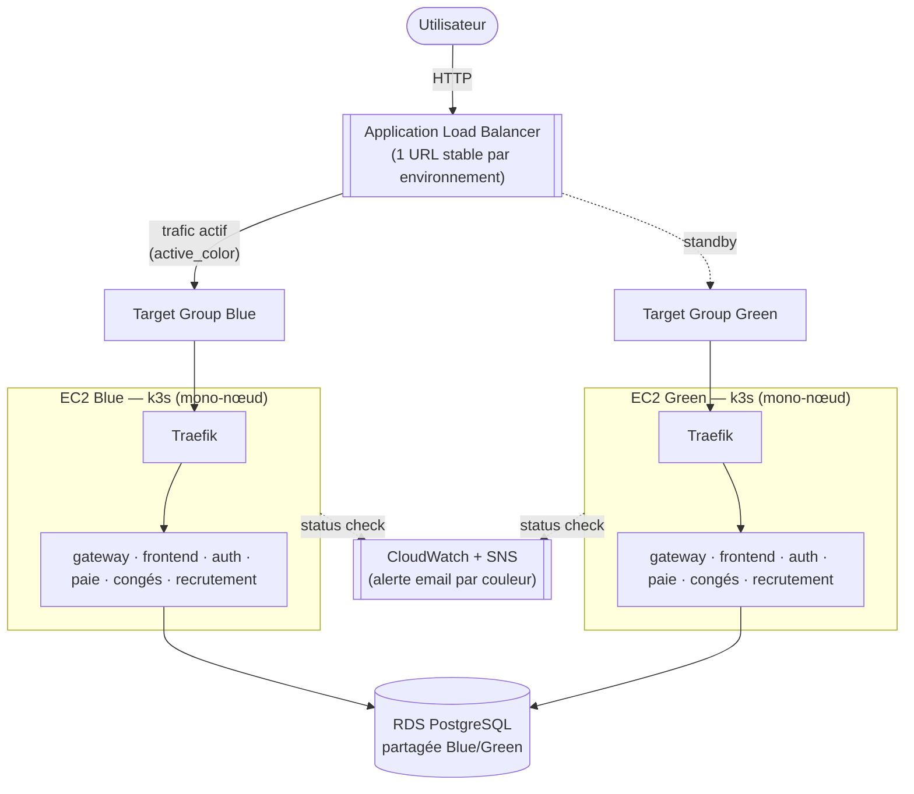

# HRFlow — Plateforme RH SaaS


[🇫🇷 Français](README.md) · [🇬🇧 English](README_en.md)

Plateforme de gestion RH pour les PME françaises.

## 🛠️ Stack

| Domaine | Technologies |
|---|---|
| 🎨 **Frontend** | React 18 |
| ⚙️ **Backend** | Node.js · Express |
| 🗄️ **Database** | PostgreSQL |
| ⚡ **Cache** | Redis |
| ☁️ **Cloud** | AWS |
| 🏗️ **Infrastructure as Code** | Terraform |
| 🚢 **Orchestration** | Kubernetes (k3s) · Traefik |

<p align="center">
  
  
  
  
  
  
  
  
</p>

## 🚀 Onboarding — Démarrage rapide

### Prérequis

| Outil | Usage | Version |
|---|---|---|
| Docker + Docker Compose | Lancer la stack complète en local | récente |
| Node.js | Dev frontend hors conteneur / tests e2e | `>= 22.0.0` |
| Git | Cloner le repo, contribuer | — |
| AWS CLI + Terraform | Travailler sur l'infrastructure (`terraform/`) | Terraform `>= 1.x` |
| kubectl | Inspecter les clusters k3s (via SSM, pas d'accès direct) | — |

### Étapes

1. Cloner le repo puis se placer à la racine.
2. Copier `.env.pmn` vers `.env.local` et remplacer les valeurs vides/placeholder par des valeurs de dev (voir [Variables d'environnement](#variables-denvironnement)).
3. Lancer la stack (voir [Installation](#installation)).
4. Vérifier que l'API répond : [http://localhost:3006/api-docs](http://localhost:3006/api-docs).
5. Lire le [guide de contribution](#-guide-de-contribution) avant de commit.

## Configuration

Le projet utilise des variables d'environnement pour sa configuration.

### Variables d'environnement

| Variable | Description | Exemple |
|---|---|---|
| `NODE_ENV` | Environnement d'exécution | `development` |
| `PORT` | Port interne d'écoute des services Node.js (dans le conteneur) | `3000` |
| `DB_HOST` | Hôte PostgreSQL | `localhost` |
| `DB_NAME` | Nom de la base PostgreSQL | `hrflow_dev` |
| `DB_USER` | Utilisateur PostgreSQL | `hrflow` |
| `DB_PORT` | Port PostgreSQL | `5434` |
| `REDIS_HOST` | Hôte Redis | `localhost` |
| `REDIS_PORT` | Port Redis | `6380` |
| `GATEWAY_HOST_PORT` | Port du gateway | `3006` |
| `FRONTEND_HOST_PORT` | Port du frontend | `3007` |
| `CORS_ALLOWED_ORIGINS` | Origines autorisées par le CORS | `http://localhost:3007` |
| `REACT_APP_API_URL` | URL de l'API utilisée par le frontend | `http://localhost:3006/api` |
| `JWT_EXPIRY` | Durée de validité du JWT | `24h` |
| `AWS_REGION` | Région AWS utilisée par l'infra | `eu-west-3` |
| `AWS_S3_BUCKET` | Bucket S3 (assets applicatifs) | — |

### Secrets

Les variables suivantes sont sensibles et **ne doivent jamais être commitées dans le dépôt** :

- `AWS_ACCESS_KEY_ID`
- `AWS_SECRET_ACCESS_KEY`
- `DB_PASSWORD`
- `JWT_REFRESH_SECRET`
- `JWT_SECRET`
- `REDIS_PASSWORD`
- `STRIPE_SECRET_KEY`

Pour le développement local, copiez `.env.pmn` (template versionné, valeurs vides/placeholder) vers `.env.local` puis renseignez vos propres valeurs de dev. `.env.local` est ignoré par git (`.gitignore`), seul `.env.pmn` (template) et `.env.ci` (config CI) sont versionnés.

Les secrets utilisés par les environnements CI/CD (build, déploiement staging/production) doivent être configurés dans les **GitHub Actions Secrets** du repository (`Settings → Secrets and variables → Actions`), avec `AWS_REGION` et `ACM_CERTIFICATE_ARN` en tant que **variables** (non secrètes) du même endroit.

## Installation
### en local
```bash
docker compose --env-file .env.local up --build -d
```

Services démarrés : `postgres`, `redis`, `auth`, `paie`, `conges`, `recrutement`, `gateway`, `frontend`.

### documentation API via le conteneur docker
L'api-gateway et les services ont chacun leur documentation :

| Service | URL de la documentation Swagger |
| --- | --- |
| API Gateway | [http://localhost:3006/api-docs](http://localhost:3006/api-docs) |
| Auth | [http://localhost:3001/api-docs](http://localhost:3001/api-docs) |
| Congés | [http://localhost:3003/api-docs](http://localhost:3003/api-docs) |
| Paie | [http://localhost:3002/api-docs](http://localhost:3002/api-docs) |
| Recrutement | [http://localhost:3004/api-docs](http://localhost:3004/api-docs) |

## Architecture

### Architecture applicative

<p align="center">
  
</p>

### Infrastructure — stratégie Blue-Green

Chaque environnement (`staging`, `production`) est provisionné par Terraform (`terraform/`) sous la forme de **deux clusters k3s mono-nœud indépendants** (Blue et Green), chacun dans une AZ différente, derrière un unique Application Load Balancer. Un seul des deux sert le trafic à la fois ; l'autre reste disponible pour un rollback quasi instantané ou pour recevoir le prochain déploiement.



Points clés :
- **RDS partagée** entre Blue et Green : toute migration de schéma doit rester rétro-compatible (additive-only) pendant la fenêtre où les deux couleurs peuvent servir le trafic.
- **Auth stateless (JWT)** : pas de session serveur à répliquer entre les couleurs lors d'une bascule.
- Le déploiement applicatif cible toujours la couleur **idle**, teste (smoke test), puis bascule le listener ALB — voir [Déploiement](#déploiement).

## Déploiement

### Pipeline CI/CD

Le pipeline (`.github/workflows/pipeline.yml`) s'enchaîne ainsi sur un push :

`changes` → `codeql` + `security` → `build-tests` → `docker` → `deploy-staging` (branches `dev-*` et `main`) → `deploy-production` (branche `main` uniquement)

Chaque étape `deploy-*` (`.github/workflows/deploy.yml`) :
1. Provisionne/synchronise l'infra Terraform de l'environnement (crée Green si besoin, jamais Blue directement — voir plus haut).
2. Déploie la nouvelle version sur la couleur **idle** (celle qui ne sert pas le trafic).
3. Smoke-teste la couleur idle.
4. Bascule le listener ALB vers la couleur idle (elle devient active).

⚠️ **Un push sur `main` déclenche automatiquement `deploy-staging` PUIS `deploy-production`, sans étape d'approbation manuelle.** Toute PR mergée sur `main` part donc en production dès que le pipeline passe.

### Rollback

En cas de souci après bascule, `.github/workflows/rollback.yml` (déclenchement manuel, `workflow_dispatch`, à choisir `staging` ou `production`) rebascule le listener ALB vers l'autre couleur — celle-ci tourne déjà en continu avec la dernière version connue-bonne, donc pas de redéploiement, juste un changement de cible sur l'ALB (quelques secondes).

### Accéder aux environnements

| Environnement | URL | Documentation API |
|---|---|---|
| Staging | http://my-project-alb-843501151.eu-west-3.elb.amazonaws.com | http://my-project-alb-843501151.eu-west-3.elb.amazonaws.com/api-docs |
| Production | http://hrflow-production-alb-568207110.eu-west-3.elb.amazonaws.com | http://hrflow-production-alb-568207110.eu-west-3.elb.amazonaws.com/api-docs |

L'URL de l'ALB est stable dans le temps (elle ne change jamais) : c'est elle qui bascule en interne entre Blue et Green, vous n'avez jamais besoin de connaître la couleur active pour accéder au site. Pour la connaître malgré tout (debug) :
```bash
cd terraform
terraform workspace select staging   # ou production
terraform output -raw active_color
```
HTTPS n'est pas encore configuré (`certificate_arn` vide dans les `*.tfvars`) — les environnements sont servis en HTTP le temps qu'un nom de domaine + certificat ACM soit disponible.

## 🤝 Guide de contribution

### Branches

- `main` : branche de production. Un push dessus déclenche staging **et** production — ne jamais pusher directement, toujours passer par une Pull Request.
- `dev-<identifiant>` (ex. `dev-lpa`) : branche de travail individuelle. Un push dessus déclenche un déploiement staging.
- `feature/<nom>` : branche de fonctionnalité plus large, mergée dans une branche `dev-*` ou dans `main` via PR.

### Commits

Le repo suit une convention proche de [Conventional Commits](https://www.conventionalcommits.org/), avec des types adaptés au projet :

```
<type>(<scope>): <description>
```

| Type | Usage |
|---|---|
| `feat` | Nouvelle fonctionnalité |
| `fix` | Correction de bug |
| `refacto` | Refactoring sans changement de comportement |
| `ci` | Pipeline / build / tests |
| `cd` | Déploiement / infra runtime |
| `docs` | Documentation |
| `var` | Variables / configuration |

Le `scope` est optionnel (ex. `fix(cd): fix cd traefic`, `refacto(infra): try BlueGreen infra`).

### Pull Requests

1. Créer sa branche à partir de `main` (ou `dev-*` pour du travail exploratoire).
2. S'assurer que le pipeline (`codeql`, `security`, `build-tests`) passe avant de demander une review.
3. Ne jamais commit de secret — utiliser les GitHub Actions Secrets pour tout ce qui touche AWS/DB/JWT/Stripe.
4. Documenter les décisions d'infrastructure non triviales directement en commentaire dans le `.tf` concerné (convention déjà en place dans `terraform/`).
5. Merger dans `main` seulement quand on est prêt pour une mise en production (cf. avertissement CI/CD ci-dessus).


