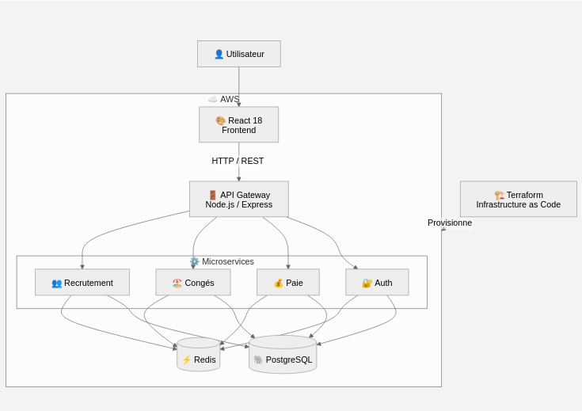
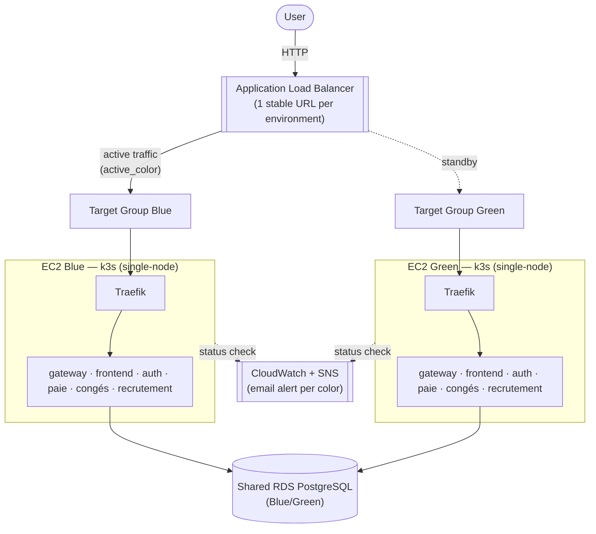

# HRFlow — Plateforme RH SaaS


[🇫🇷 Français](README.md) · [🇬🇧 English](README_en.md)

SaaS HR management platform for French SMEs.

## 🛠️ Tech Stack

| Domain | Technologies |
|---|---|
| 🎨 **Frontend** | React 18 |
| ⚙️ **Backend** | Node.js · Express |
| 🗄️ **Database** | PostgreSQL |
| ⚡ **Cache** | Redis |
| ☁️ **Cloud** | AWS |
| 🏗️ **Infrastructure as Code** | Terraform |
| 🚢 **Orchestration** | Kubernetes (k3s) · Traefik |

<p align="center">
  
  
  
  
  
  
  
  
</p>

## 🚀 Onboarding — Quick start

### Prerequisites

| Tool | Purpose | Version |
|---|---|---|
| Docker + Docker Compose | Run the full stack locally | recent |
| Node.js | Frontend dev outside containers / e2e tests | `>= 22.0.0` |
| Git | Clone the repo, contribute | — |
| AWS CLI + Terraform | Work on the infrastructure (`terraform/`) | Terraform `>= 1.x` |
| kubectl | Inspect the k3s clusters (via SSM, no direct access) | — |

### Steps

1. Clone the repo and move to its root.
2. Copy `.env.pmn` to `.env.local` and replace the empty/placeholder values with your own dev values (see [Environment variables](#environment-variables)).
3. Start the stack (see [Installation](#installation)).
4. Check the API is up: [http://localhost:3006/api-docs](http://localhost:3006/api-docs).
5. Read the [contributing guide](#-contributing-guide) before committing.

## Configuration

The project uses environment variables for its configuration.

### Environment variables

| Variable | Description | Example |
|---|---|---|
| `NODE_ENV` | Runtime environment | `development` |
| `PORT` | Internal listening port of the Node.js services (inside the container) | `3000` |
| `DB_HOST` | PostgreSQL host | `localhost` |
| `DB_NAME` | PostgreSQL database name | `hrflow_dev` |
| `DB_USER` | PostgreSQL user | `hrflow` |
| `DB_PORT` | PostgreSQL port | `5434` |
| `REDIS_HOST` | Redis host | `localhost` |
| `REDIS_PORT` | Redis port | `6380` |
| `GATEWAY_HOST_PORT` | API Gateway port | `3006` |
| `FRONTEND_HOST_PORT` | Frontend port | `3007` |
| `CORS_ALLOWED_ORIGINS` | Origins allowed by CORS | `http://localhost:3007` |
| `REACT_APP_API_URL` | API URL used by the frontend | `http://localhost:3006/api` |
| `JWT_EXPIRY` | JWT validity duration | `24h` |
| `AWS_REGION` | AWS region used by the infrastructure | `eu-west-3` |
| `AWS_S3_BUCKET` | S3 bucket (application assets) | — |

### Secrets

The following variables contain sensitive information and **must never be committed to the repository**:

- `AWS_ACCESS_KEY_ID`
- `AWS_SECRET_ACCESS_KEY`
- `DB_PASSWORD`
- `JWT_REFRESH_SECRET`
- `JWT_SECRET`
- `REDIS_PASSWORD`
- `STRIPE_SECRET_KEY`

For local development, copy `.env.pmn` (versioned template, empty/placeholder values) to `.env.local` and fill in your own dev values. `.env.local` is git-ignored (`.gitignore`); only `.env.pmn` (template) and `.env.ci` (CI config) are versioned.

Secrets used by the CI/CD environments (build, staging/production deployment) must be configured in the repository's **GitHub Actions Secrets** (`Settings → Secrets and variables → Actions`), with `AWS_REGION` and `ACM_CERTIFICATE_ARN` set as **variables** (non-secret) in the same place.

## Installation
### Locally
```bash
docker compose --env-file .env.local up --build -d
```

Services started: `postgres`, `redis`, `auth`, `paie`, `conges`, `recrutement`, `gateway`, `frontend`.

### API documentation via the Docker container
The API Gateway and each service provide their own Swagger documentation:

| Service | Swagger Documentation URL |
| --- | --- |
| API Gateway | [http://localhost:3006/api-docs](http://localhost:3006/api-docs) |
| Auth | [http://localhost:3001/api-docs](http://localhost:3001/api-docs) |
| Congés | [http://localhost:3003/api-docs](http://localhost:3003/api-docs) |
| Paie | [http://localhost:3002/api-docs](http://localhost:3002/api-docs) |
| Recrutement | [http://localhost:3004/api-docs](http://localhost:3004/api-docs) |

## Architecture

### Application architecture

<p align="center">
  
</p>

### Infrastructure — Blue-Green strategy

Each environment (`staging`, `production`) is provisioned by Terraform (`terraform/`) as **two independent single-node k3s clusters** (Blue and Green), each in a different AZ, behind a single Application Load Balancer. Only one of the two serves live traffic at a time; the other stays available for a near-instant rollback or to receive the next deployment.



Key points:
- **Shared RDS** between Blue and Green: any schema migration must stay backward-compatible (additive-only) during the window where both colors may serve traffic.
- **Stateless auth (JWT)**: no server session to replicate between colors during a switch.
- Application deployment always targets the **idle** color, smoke-tests it, then switches the ALB listener — see [Deployment](#deployment).

## Deployment

### CI/CD Pipeline

The pipeline (`.github/workflows/pipeline.yml`) chains as follows on a push:

`changes` → `codeql` + `security` → `build-tests` → `docker` → `deploy-staging` (branches `dev-*` and `main`) → `deploy-production` (`main` branch only)

Each `deploy-*` step (`.github/workflows/deploy.yml`):
1. Provisions/syncs the environment's Terraform infra (creates Green if needed, never touches Blue directly — see above).
2. Deploys the new version to the **idle** color (the one not currently serving traffic).
3. Smoke-tests the idle color.
4. Switches the ALB listener to the idle color (it becomes active).

⚠️ **A push on `main` automatically triggers `deploy-staging` THEN `deploy-production`, with no manual approval step.** Any PR merged into `main` therefore ships to production as soon as the pipeline passes.

### Rollback

If something goes wrong after a switch, `.github/workflows/rollback.yml` (manual trigger, `workflow_dispatch`, choose `staging` or `production`) switches the ALB listener back to the other color — which is already running continuously with the last known-good version, so there's no redeploy involved, just an ALB target change (a few seconds).

### Accessing the environments

| Environment | URL | API Documentation |
|---|---|---|
| Staging | http://my-project-alb-843501151.eu-west-3.elb.amazonaws.com | http://my-project-alb-843501151.eu-west-3.elb.amazonaws.com/api-docs |
| Production | http://hrflow-production-alb-568207110.eu-west-3.elb.amazonaws.com | http://hrflow-production-alb-568207110.eu-west-3.elb.amazonaws.com/api-docs |

The ALB URL is stable over time (it never changes): it's the one that internally switches between Blue and Green, so you never need to know which color is active to reach the site. To check anyway (debugging):
```bash
cd terraform
terraform workspace select staging   # or production
terraform output -raw active_color
```
HTTPS isn't configured yet (`certificate_arn` is empty in the `*.tfvars` files) — environments are served over HTTP until a domain name + ACM certificate are available.

## 🤝 Contributing guide

### Branches

- `main`: production branch. A push here triggers staging **and** production — never push directly, always go through a Pull Request.
- `dev-<id>` (e.g. `dev-lpa`): individual working branch. A push here triggers a staging deployment.
- `feature/<name>`: larger feature branch, merged into a `dev-*` branch or into `main` via PR.

### Commits

The repo follows a convention close to [Conventional Commits](https://www.conventionalcommits.org/), with types adapted to the project:

```
<type>(<scope>): <description>
```

| Type | Usage |
|---|---|
| `feat` | New feature |
| `fix` | Bug fix |
| `refacto` | Refactoring, no behavior change |
| `ci` | Pipeline / build / tests |
| `cd` | Deployment / runtime infra |
| `docs` | Documentation |
| `var` | Variables / configuration |

The `scope` is optional (e.g. `fix(cd): fix cd traefic`, `refacto(infra): try BlueGreen infra`).

### Pull Requests

1. Branch off `main` (or a `dev-*` branch for exploratory work).
2. Make sure the pipeline (`codeql`, `security`, `build-tests`) passes before requesting a review.
3. Never commit a secret — use GitHub Actions Secrets for anything touching AWS/DB/JWT/Stripe.
4. Document non-trivial infrastructure decisions directly as comments in the relevant `.tf` file (existing convention in `terraform/`).
5. Merge into `main` only when ready to ship to production (see the CI/CD warning above).

## Tests
TODO

---
Last updated: August 2026
